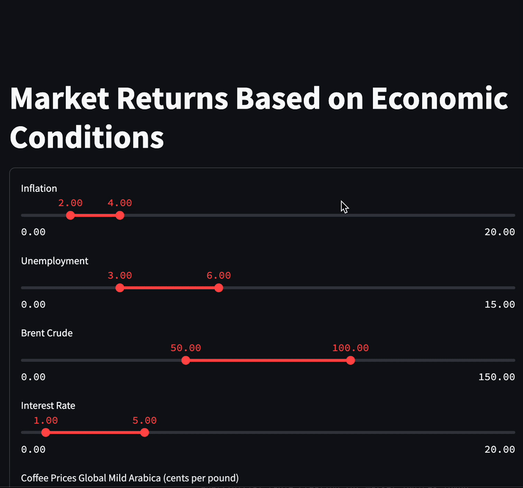

# 📈 Market Returns Based on Economic Conditions

This web application helps investors and analysts explore how major market indices have historically performed under specific economic conditions. Users can filter by macroeconomic variables (e.g., inflation, unemployment), and the app returns visualizations of forward returns based on matching historical periods.

---

## 🧠 Features

- 🎚 **Interactive Filtering**  
  Select custom ranges for inflation, unemployment, etc., to find historical months where those conditions held.

- 📊 **Market Return Visualizations**  
  View 3-year and 5-year forward returns for major indices (S&P 500, Nasdaq, etc.) starting from matching months.

- 📈 **Index Price Progression**  
  Select an index to see its monthly price trend after the chosen historical month.

- ⚙️ **Automated ETL Pipelines with Airflow**  
  - `yfinance`: Monthly index performance (proxy date = 15th)  
  - `Alpha Vantage`: Key economic indicators

- 🧱 **Full-Stack Architecture**  
  - **Backend**: FastAPI serving filtered data  
  - **Frontend**: Streamlit for user interaction  
  - **Database**: PostgreSQL  
  - **Orchestration**: Airflow-managed ETL jobs

---

